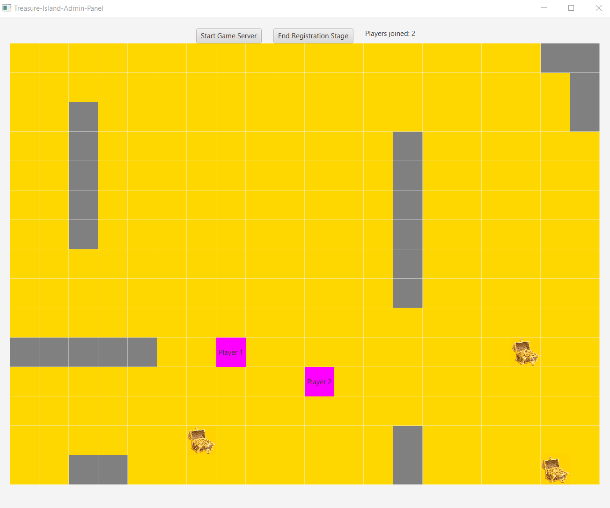

Projekt zawiera 2 aplikacje służące do gry w "Wyspę Skarbów", do komunikacji wykorzystane zostały w całości gniazda TCP/IP (klasy ServerSocket, Socket):
-Treasure-Island-Admin-Panel służy za serwer, który obsługuje zapytania klientów oraz wysyła do nich odpowiedzi umożliwiające grę. Stanowi także panel zarządcy - aplikacja umożliwia obserwację całej planszy oraz decyzję, kiedy rozpocznie się gra.
-Treasure Island, jest to aplikacja kliencka (gracza) umożliwiająca dołączenie do gry oraz wybór pomiędzy sterowaniem przez komputer lub sterowanie manualne.
  
Działanie aplikacji zakłada istnienie jednej instancji Treasure-Island-Admin-Panel, natomiast instancji aplikacji graczy może być wiele.
