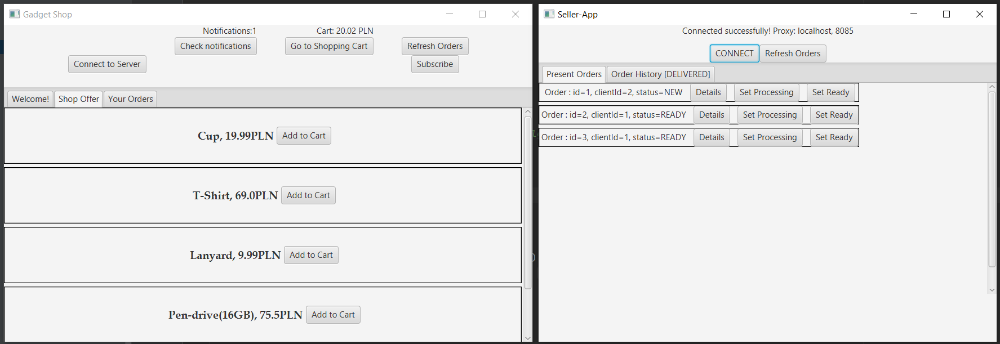

Projekt zawiera 3 proste aplikacje, komunikujące się ze sobą za pomocą RMI:
- Shop-App, służy za repozytroium sklepu, Shop-App udostępnia namiastki swojej klasy pozostałym aplikacjom.
- Gadget Shop, jest to aplikacja kliencka, umożliwiająca rejestrację w sklepie, składanie zamówień oraz subskrypcję zamówienia (Klient otrzyma powiadomienie po zmianie statusu zamówienia)
- Seller-App, służy do obsługi zamówień klientów.
  
Działanie systemu zakłada istnienie jednej instancji Shop-App, natomiast instancji aplikacji klienckich Gadget Shop oraz Seller-App może być wiele.
