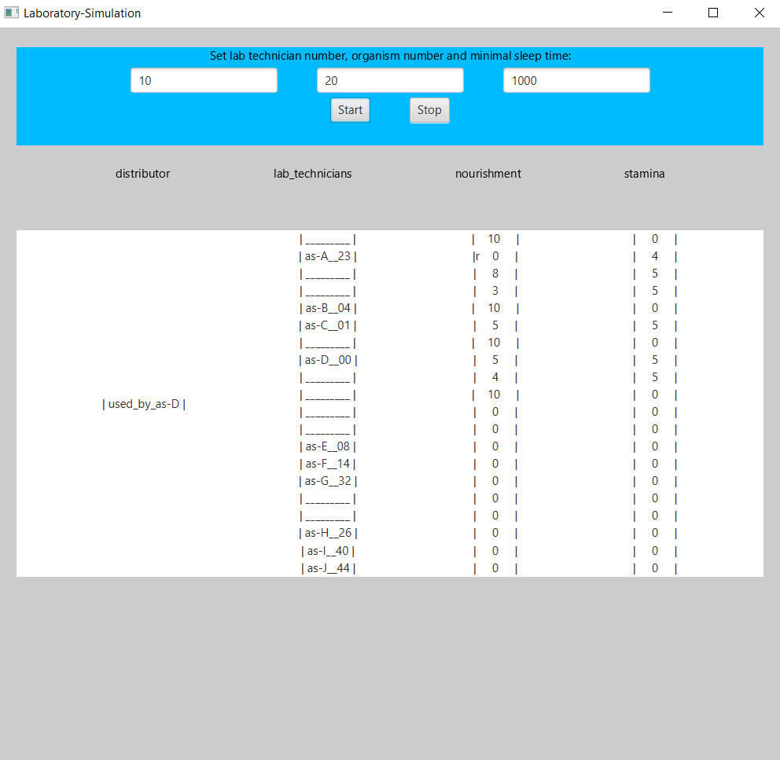

Prosta "Symulacja Laboratorium". Występuje tutaj podział na tzw. aktorów - Asystentów oraz Organizmy - zaimplementowani przy pomocy wątków, a także zasoby - Obiekty reprezentujące dystrybutor oraz "Karmniki" organizów. Zaimplementowana została prosta synchronizacja wątków oraz prosta reprezentacja graficzna na labelkach.
